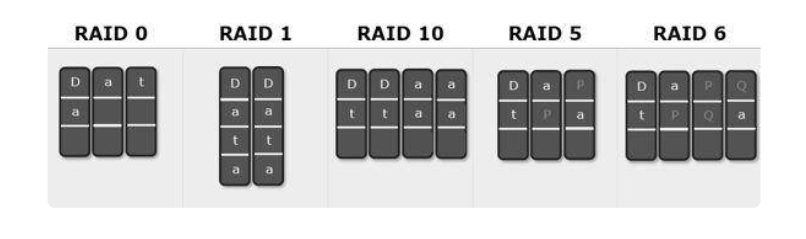
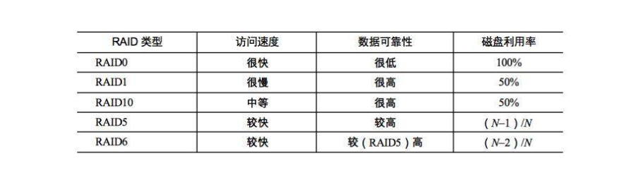

NAS的选购首先最应该关注的就是盘位的选择。盘位的多少不仅仅关系到总存储空间的大小，还关系到数据安全性的保障。NAS的最重要目的就是数据的存储，而数据存储的第一要务就是保证数据的安全。无论你使用几盘位的NAS，首先一定要组建有数据保护功能的Raid。两盘位就Raid1，四盘位可以raid5 or raid6。

一般家用机型根据需求不同，最常用的就是2盘位或4盘位的NAS。存储空间需求不高的用户可以选择2盘位产品，不过2盘位的产品在raid选择上就只有raid0、raid1和basic的选择，其中只有raid1能够提供数据的保护功能，不过将会折损一半的储存空间，2盘位产品在安全和空间上只能2选一。因此相对来说4盘位就灵活了许多，如果预算足够的话还是优先选择4盘位产品。

# 两大品牌

威联通和群晖

**1. 威联通**

威联通在硬件的多样性、功能的多样性上发挥的淋漓尽致，在同等价位的产品中，威联通的硬件配置要明显高于群晖，无论是在硬件扩展、万兆支持，还是HDMI视频直接输出等功能，都是远强于群晖的。威联通2000+的机器就可以支持万兆网络，而群辉支持万兆机型最低也要6000+。所以从硬件层面来讲，**威联通的性价比最高**。

**2. 群晖**

看过上面一段你应该会发现，威联通的优势全部体现在硬件层面。没错！群晖的优势完全体现在软件层面。群晖在系统、软件的**人性化设置**层面是碾压威联通的，这是不争的事实。虽然群晖的软件功能威联通也能够实现，但在设置的难易度上却不是一个级别的。群晖的各项设置都更人性化、本土化，功能介绍一目了然，使学习成本大大减少，更适合毫无经验的新人上手。

## RAID

RAID（独立磁盘冗余阵列）技术是将多块普通磁盘组成一个阵列，共同对外提供服务。主要是为了改善磁盘的存储容量、读写速度，增强磁盘的可用性和容错能力。目前服务器级别的计算机都支持插入多块磁盘（8 块或者更多），通过使用 RAID 技术，实现数据在多块磁盘上的并发读写和数据备份。

#### RAID 0 

先假设服务器有 N 块磁盘，RAID 0 是数据在从内存缓冲区写入磁盘时，根据磁盘数量将数据分成 N 份，这些数据同时并发写入 N 块磁盘，使得数据整体写入速度是一块磁盘的 N 倍；读取的时候也一样，因此 RAID 0 具有极快的数据读写速度。但是 RAID 0 不做数据备份，N 块磁盘中只要有一块损坏，数据完整性就被破坏，其他磁盘的数据也都无法使用了。

####  RAID 1 

RAID 1 是数据在写入磁盘时，将一份数据同时写入两块磁盘，这样任何一块磁盘损坏都不会导致数据丢失，插入一块新磁盘就可以通过复制数据的方式自动修复，具有极高的可靠性。

#### RAID 10

结合 RAID 0 和 RAID 1 两种方案构成了 RAID 10，它是将所有磁盘 N 平均分成两份，数据同时在两份磁盘写入，相当于 RAID 1；但是平分成两份，在每一份磁盘（也就是 N/2 块磁盘）里面，利用 RAID 0 技术并发读写，这样既提高可靠性又改善性能。不过 RAID 10 的磁盘利用率较低，有一半的磁盘用来写备份数据。

一般情况下，一台服务器上很少出现同时损坏两块磁盘的情况，在只损坏一块磁盘的情况下，如果能利用其他磁盘的数据恢复损坏磁盘的数据，这样在保证可靠性和性能的同时，磁盘利用率也得到大幅提升。

#### RAID 3

RAID 3 可以在数据写入磁盘的时候，将数据分成 N-1 份，并发写入 N-1 块磁盘，<b>并在第 N 块磁盘记录校验数据</b>，这样任何一块磁盘损坏（包括校验数据磁盘），都可以利用其他 N-1 块磁盘的数据修复。但是在数据修改较多的场景中，任何磁盘数据的修改，都会导致第 N 块磁盘重写校验数据。频繁写入的后果是第 N 块磁盘比其他磁盘更容易损坏，需要频繁更换，所以 RAID 3 很少在实践中使用，因此在上面图中也就没有单独列出。

#### RAID  5 

相比 RAID  3，RAID 5 是使用更多的方案。RAID  5 和 RAID  3 很相似，但是<b>校验数据不是写入第 N 块磁盘，而是螺旋式地写入所有磁盘中</b>。这样校验数据的修改也被平均到所有磁盘上，避免 RAID  3 频繁写坏一块磁盘的情况。

####  RAID 6

如果数据需要很高的可靠性，在出现同时损坏两块磁盘的情况下（或者运维管理水平比较落后，坏了一块磁盘但是迟迟没有更换，导致又坏了一块磁盘），仍然需要修复数据，这时候可以使用 RAID 6。RAID  6 和 RAID  5 类似，但是数据只写入 N-2 块磁盘，并螺旋式地在两块磁盘中写入校验信息（使用不同算法生成）。

在计算机领域，实现更强的计算能力和更大规模的数据存储有两种思路，一种是升级计算机，一种是用分布式系统。前一种也被称作“垂直伸缩”（scaling up），通过升级 CPU、内存、磁盘等将一台计算机变得更强大；后一种是“水平伸缩”（scaling out），添加更多的计算机到系统中，从而实现更强大的计算能力。

RAID 可以看作是一种垂直伸缩，一台计算机集成更多的磁盘实现数据更大规模、更安全可靠的存储以及更快的访问速度。而 HDFS 则是水平伸缩，通过添加更多的服务器实现数据更大、更快、更安全存储与访问。RAID 技术只是在单台服务器的多块磁盘上组成阵列，大数据需要更大规模的存储空间和更快的访问速度。将 RAID 思想原理应用到分布式服务器集群上，就形成了 Hadoop 分布式文件系统 HDFS 的架构思想。

