推荐版本10.4+

- 资源库  四颗星

- 事件  一颗星

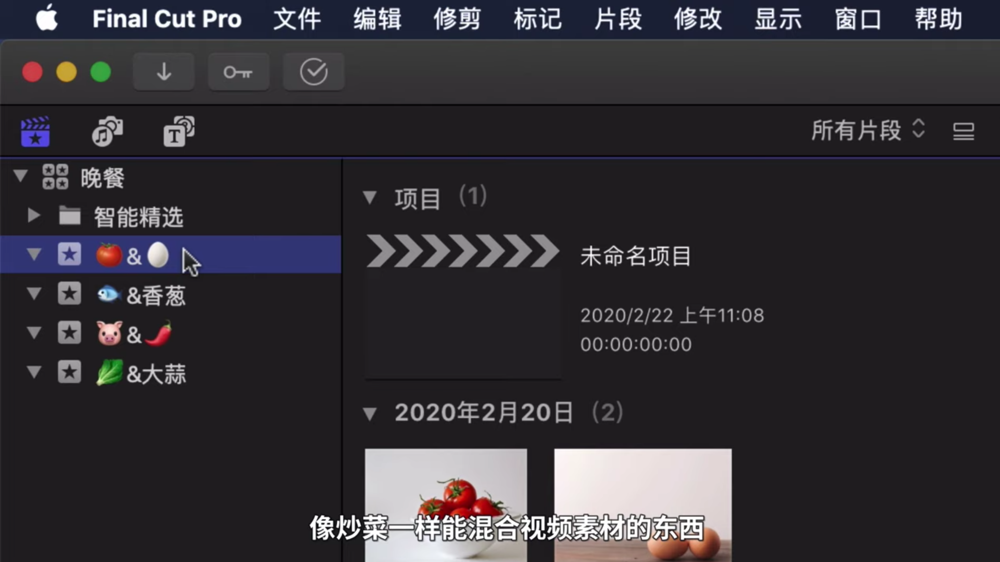

- 项目

事件中可以衍生出多个项目

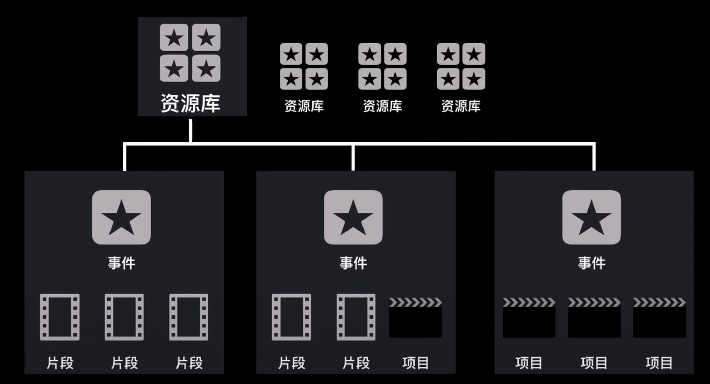

新建项目开始剪片子。

 将预览的视频拉入剪辑时间线，可以通过快捷键I/O控制入点和出点，选择一部分加入时间线，也可以按E，自动加入时间线。

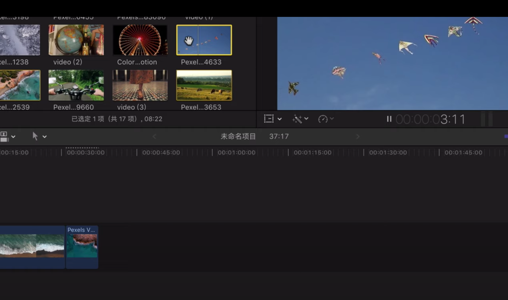

预览时候也可以用快捷键。

L向前，K暂停，J回退，LL加速。

修剪工具T：固定时间窗内拖动

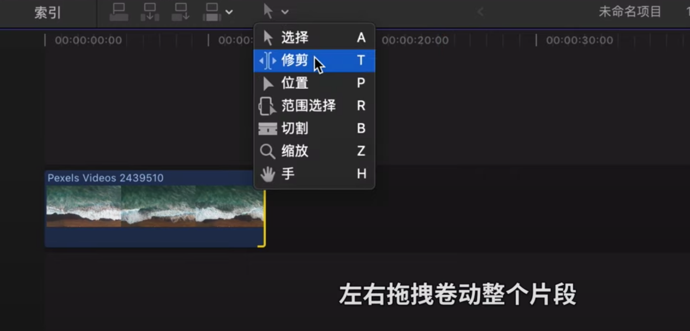

- 裁剪B blade

- command+B，

- B按住不松开，切完再送，自动回到选择。

command+z 撤销 

 

Q添加视频到时间线

option+command+delete  删除选中的，忽略附属的。B-roll

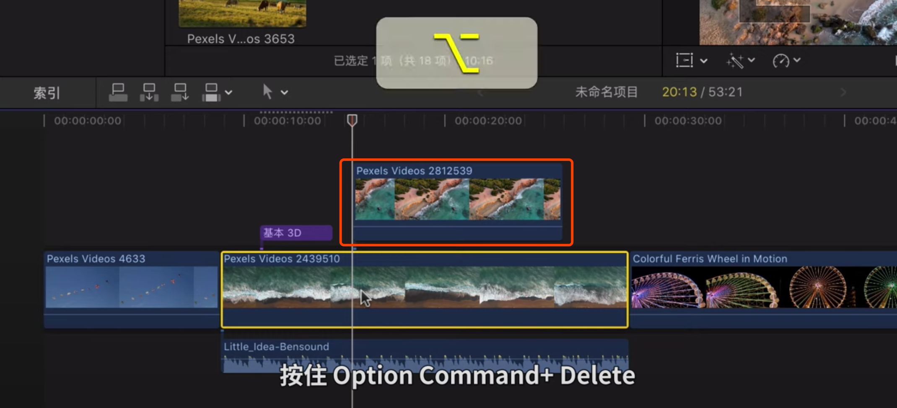

速度变化。

command+R显示速度条，shift+B分段调整速度。

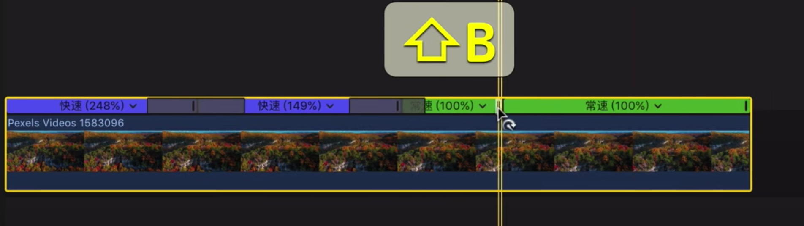

慢速要高帧率。60fps ===>30fps，慢速50%

白点清除：渲染

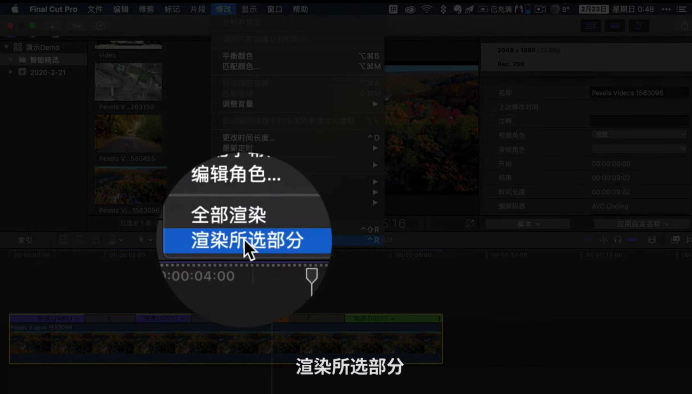

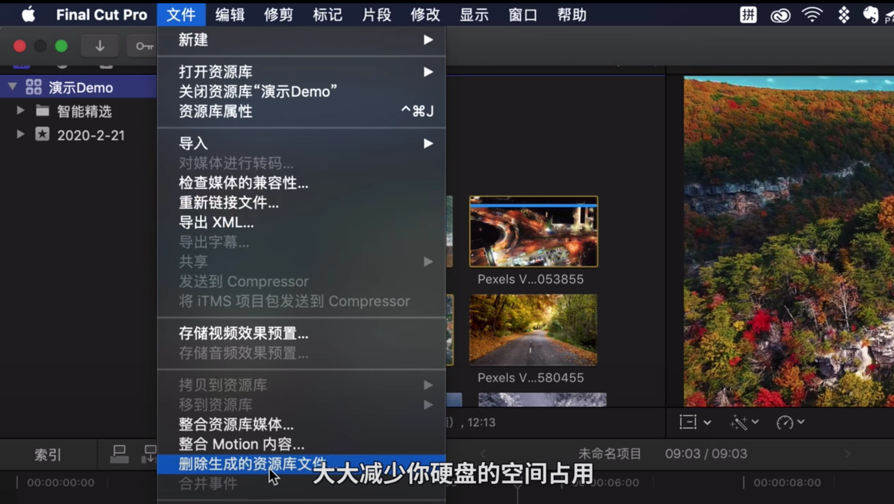

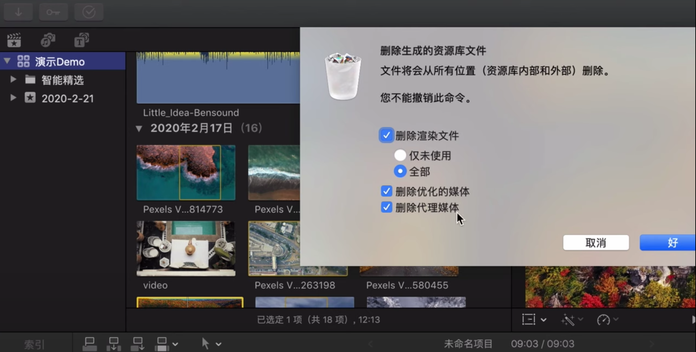

command + + 放大时间线

command + - 缩小时间线

shift + z 完整呈现时间线

 吸附快捷键N 

 开启预览功能：S

声音调整。快捷键R选择范围，局部调节，control + + / control + - 进行精细化调整

字幕添加，q/shift+q 位置差异

control+T 添加最常用的字幕

command+T添加转场。双击也可以

导出：command+E

如果要去别的软件继续编辑，如达芬奇，选prores

如果用于网络传输就选H.264

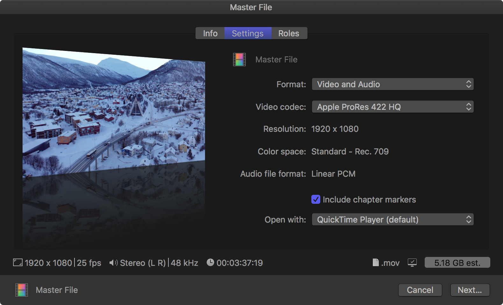

默认这样导出是MOV格式的，如果想要MP4格式：

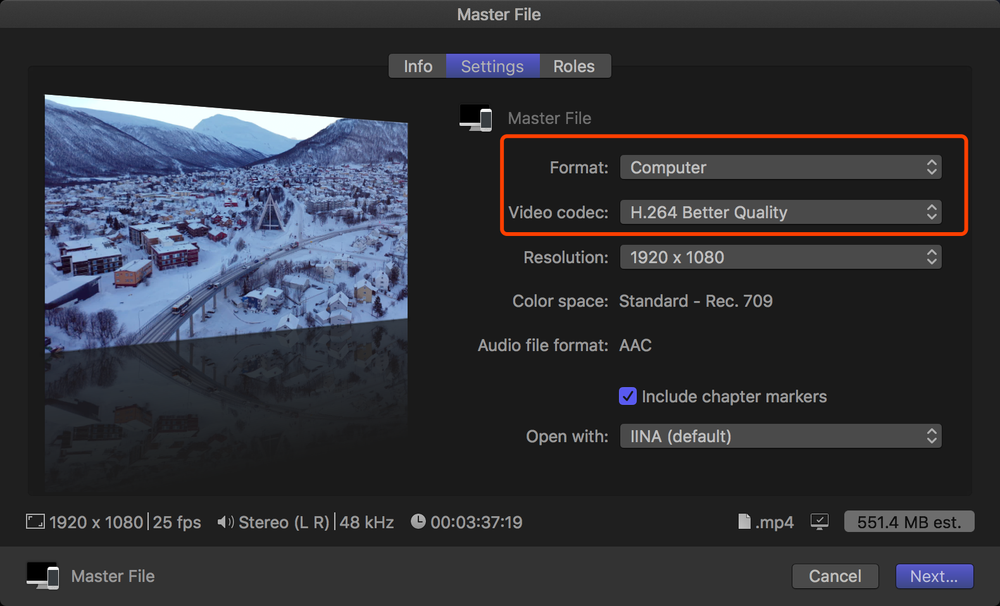

将设置添加到默认：

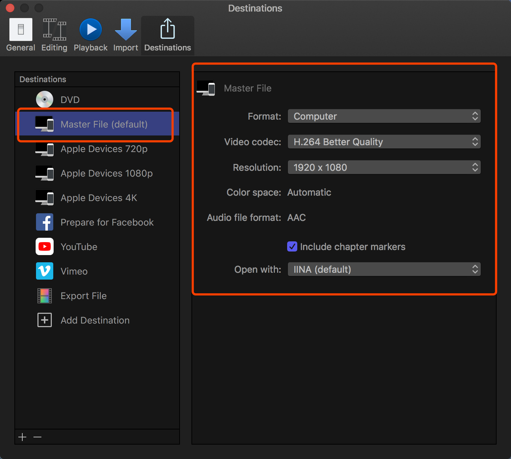

## Reference

[快速入门 Final Cut Pro X，0 门槛高效率剪辑视频](https://www.youtube.com/watch?v=3pGGTkeazH0)

https://www.youtube.com/watch?v=He2KrjrXwKU&list=PLPGawU13YdgW0AEKs8bs7rjzxTrAoH_vD

